# Active Directory IT Support & Ticketing System Lab Setup
## Intro
This project sets up an **Active Directory (AD) environment** integrated with **osTicket**, an open-source ticketing system, to simulate an IT support workflow. The lab is built using **Oracle VirtualBox** and consists of:

1. **Windows Server 2022 (DC1)** – Acts as the AD Domain Controller.
2. **Windows 10 Pro (Win10-Workstation)** – A domain-joined Windows workstation.
3. **Ubuntu Desktop(Ubuntu-Workstation)** - A domain-joined Linux workstation
4. **Ubuntu Desktop (osTicket)** – Hosts the osTicket system.

This setup mirrors real-world IT infrastructure, incorporating **Active Directory services, DHCP, DNS, Group Policies, and user management** while providing a help desk solution through osTicket.

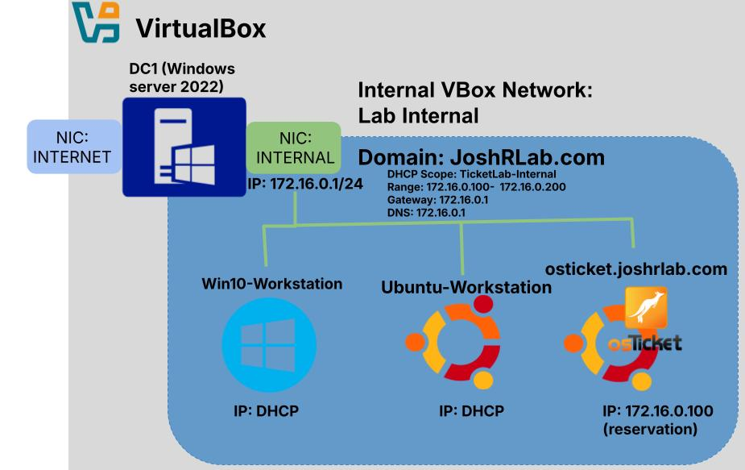
## Lab Setup
### Basic VM Configuration
- **Windows Server 2022 (DC1)** is configured as a Domain Controller.
- **Two network adapters** are set up in VirtualBox:
    - **NAT (INTERNET)** for external access.
    - **Internal Network (Lab-Internal)** for communication between lab machines.

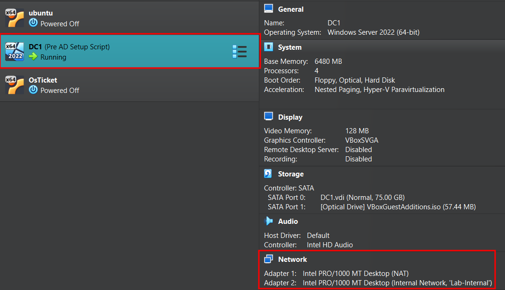

Within the VM the Computer name is changed to `DC1` and the adapter names are configured correctly (specifying `INTERNAL` and `INTERNET` adapter)
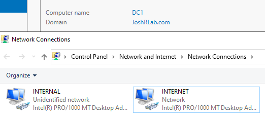

The **internal adapter** is assigned **172.16.0.1/24**, using itself as the DNS server.
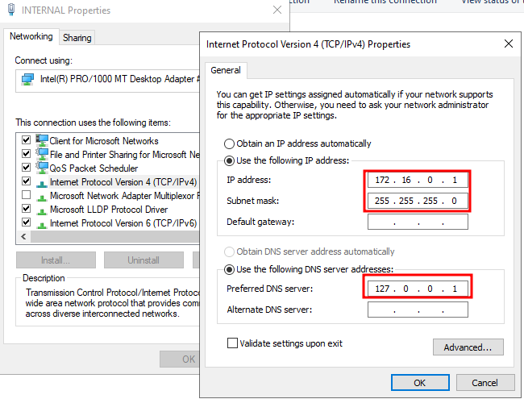
### Active Directory & Networking Services
The Windows Server VM is configured with:

1. **Active Directory Domain Services (AD DS)** – Domain: `JoshRLab.com`

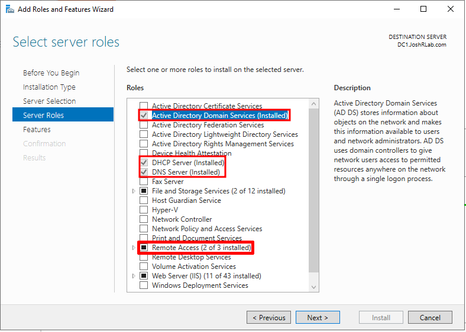

2. **Routing & Remote Access** – NAT setup for internal network traffic.
The NAT service is selected and the `INTERNET` network interface is configured to connect to the Internet. 

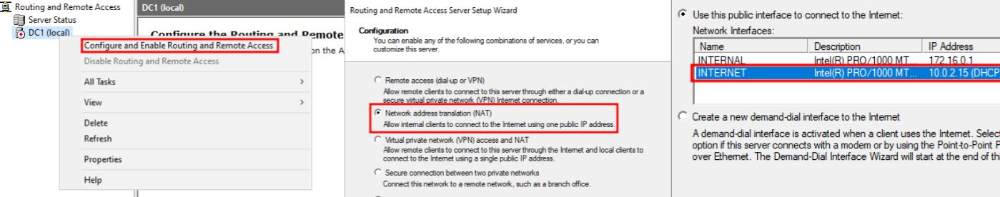

3. **DHCP** – Assigns IPs to domain computers (range: `172.16.0.100 - 172.16.0.200`).
A new DHCP scope and pool are configured as well as an excluded range. The reservation for the OsTicket Server is highlighted in green (configured later).

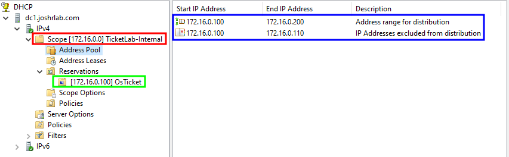

4. **DNS** – Hosts domain records, including an `A` record for the osTicket server which will be configured later.
### Joining a Windows 10 Client to the Domain
A **Windows 10 Pro VM** is installed and configured:
- Connect to the **Lab-Internal** network (highlighted in red).

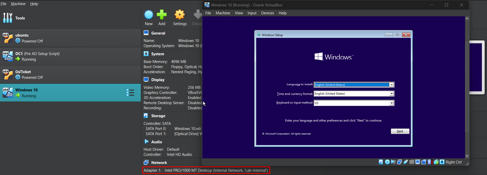

- Change the computer name to `Win10-Workstation` and join the **JoshRLab.com** domain.

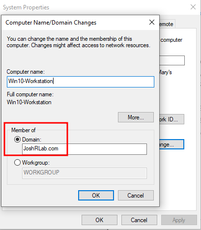
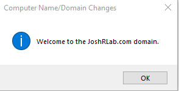

- Log in using an **Active Directory account** (e.g., `kkhan`) confirms that the computer is properly connected to the domain.

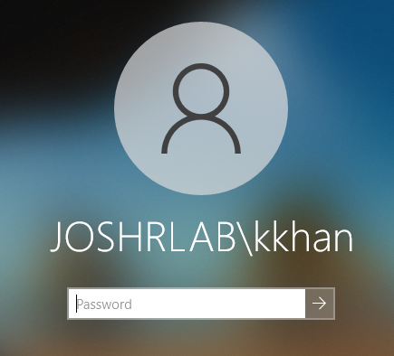

- Receive an IP address (`172.16.0.111`) from the DHCP server, confirming DHCP functionality.

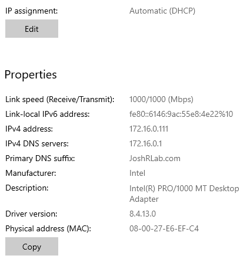
## Basic Active Directory Configuration
### Organizational Units (OUs) & Users
A structured **OU hierarchy** is created for different departments, users, and devices:
```
JoshRLab.com (Root Domain)
│── Company (OU)
│   ├── Executive (OU)
│   ├── HR (OU)
│   ├── IT (OU)
│   ├── Finance (OU)         
│   ├── Sales (OU)
│   ├── Marketing (OU)
│   ├── Engineering (OU)
│── Company Computers (OU)
│   ├── Workstations (OU)
│   ├── Servers (OU)
│── Security Groups (OU)
```

| **Department**  | **Users**                                                 | **Notes**                              |
| --------------- | --------------------------------------------------------- | -------------------------------------- |
| **Executive**   | `jdoe (CEO)`                                              | Sensitive Files limited accesss        |
| **HR**          | `awilliams (HR Manager)`, `bturner (HR Assistant)`        | HR Files access                        |
| **IT**          | `tjones (SysAdmin)`, `kkhan (Helpdesk)`                   | IT Admins have domain admin privileges |
| **Finance**     | `lmorris (CFO)`, `rperez (Accountant)`                    | Financial Files access                 |
| **Sales**       | `jkim (Sales Rep)`                                        | Sales Files access                     |
| **Marketing**   | `mjohnson (Marketing Lead)`, `swilson (Graphic Designer)` | Marketing Files access                 |
| **Engineering** | `glopez (Software Dev)`                                   | Dev environment access                 |

- **Users are created via PowerShell scripts** using a CSV input file.
- Each user is placed in their **respective department OU**.

users.csv file specifies each user and their details:

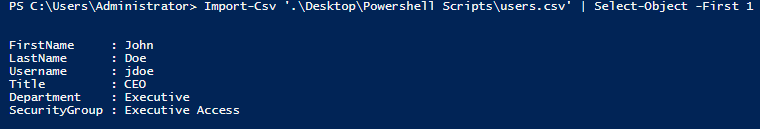

Setup script output:


Users and Computers View:

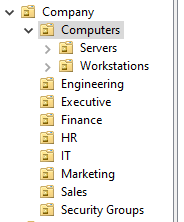

### Group Policy Setup 
The following policies are enforced:

| **GPO Name**             | **Applied To**    | **Purpose**                              |
| ------------------------ | ----------------- | ---------------------------------------- |
| `Account Lockout Policy` | Domain Level      | Enforce strong passwords & expiration    |
| `Mapped Drives`          | All Users         | Auto-maps network shares per department. |
| `RDP Access Policy`      | IT & Admin Groups | Allow remote access only for IT/Admins   |
| `Screen Lock Policy`     | All Users         | Auto-lock screens after inactivity       |

## osTicket Installation
### Ubuntu Server Prerequisites Setup
An **Ubuntu Desktop VM** is configured for osTicket, installing the following required services:
1. Apache webserver
2. MySQL database
3. PHP and required PHP extensions
```
sudo apt install -y apache2 mysql-server php libapache2-mod-php \
php-common php-gd php-imap php-intl php-apcu php-cli php-mbstring \
php-curl php-mysql php-json php-xml
```

### MySQL Database Setup
1. create a new database for the service: `os_ticket`
2. create a new user, `os_ticket` with access to the database 
```
CREATE DATABASE os_ticket;
CREATE USER 'os_ticket'@'localhost' IDENTIFIED BY 'Password1';
GRANT ALL PRIVILEGES ON os_ticket.* TO 'os_ticket'@'localhost';
FLUSH PRIVILEGES;
```
### osTicket Deployment
- [Download](https://osticket.com/download/) and extract osTicket to `/var/www/os_ticket/`.
- Configure Apache with the following Virtual Host file and enable it:
```
<VirtualHost *:80>
    ServerName 172.16.0.100
    DocumentRoot "/var/www/os_ticket/upload"
    <Directory "/var/www/os_ticket/upload">
        Require all granted
        AllowOverride All
    </Directory>
    ErrorLog ${APACHE_LOG_DIR}/error.log
    CustomLog ${APACHE_LOG_DIR}/access.log combined
</VirtualHost>
```

- Restart Apache and complete the **osTicket web setup** at `http://172.16.0.100`.


- **DHCP Reservation:** on the DC assigns `172.16.0.100` to the osTicket server.

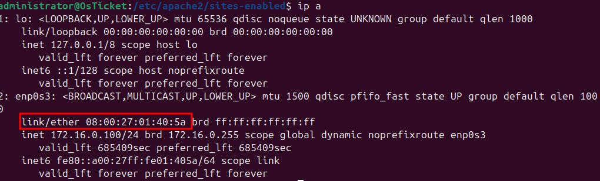


- **DNS A Record:** on the DC creates `osticket.joshrlab.com` pointing to `172.16.0.100`.


Now, domain users can access osTicket from **any computer** in the domain via `http://osticket.joshrlab.com`.
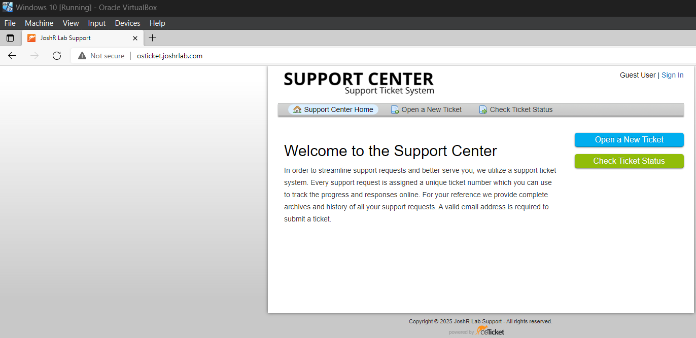

## osTicket Configuration (in progress)
## 